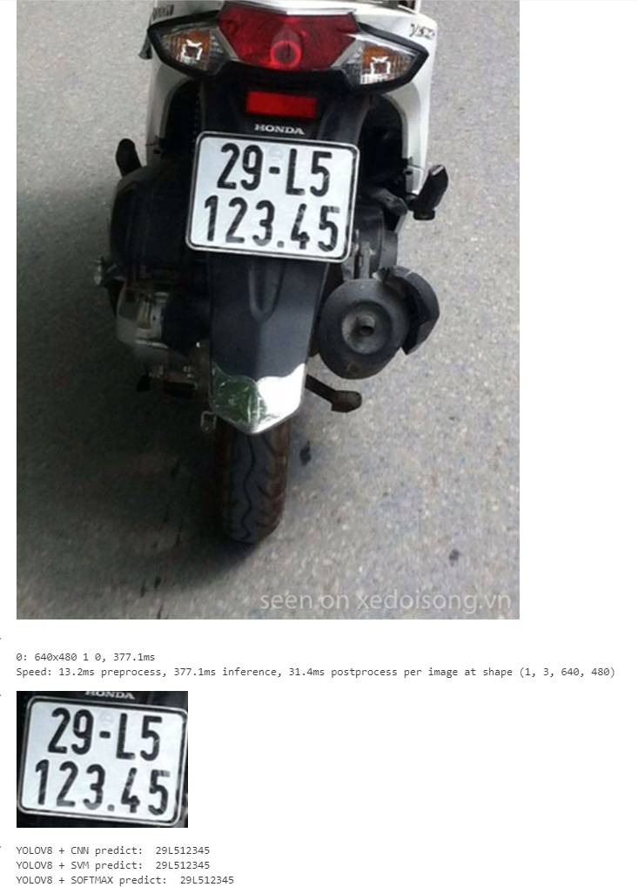

License Plate Recognition
=========================================

### Problem Description
The goal of this project is to recognize motorcycle license plates from images. Given an image containing a motorcycle, the system extracts the license plate, aligns it using image processing techniques, segments individual characters, and finally recognizes them using a classification model.

### Approach
1. **License Plate Detection**  
   - The input is an image containing a motorcycle.
   - The license plate region is detected and cropped from the image using YOLOv8.

2. **License Plate Alignment**  
   -   Hough Transform and Contour detection are used to align and correct the perspective of the license plate.

3. **Character Segmentation**  
   - Connected Component Lablelings (CCL) is applied to segment individual characters from the plate.

4. **Character Recognition**  
   - A classification model is used to recognize the segmented characters.

### Demo Image

